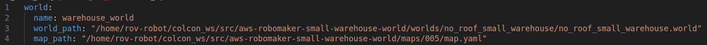
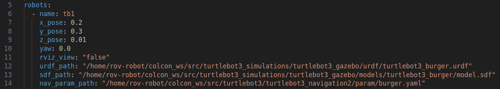
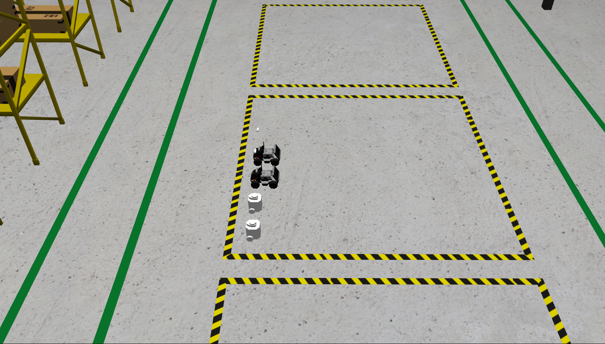
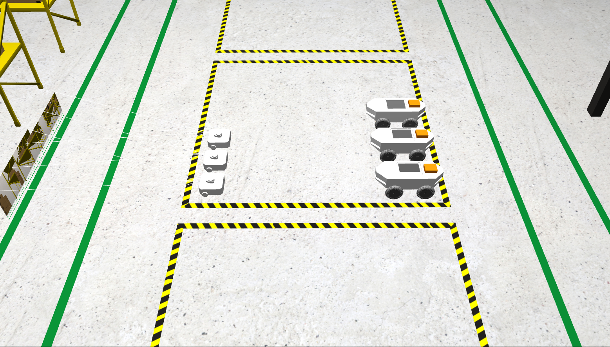

# Multi Robot System

Multi Robot System developed for ROS2 Humble, allows the easy incorporation of several robot models with little configuration. There is no limit on the number of robots, if you incorporate UGV you can provide your parameter file for autonomous navigation.

## Features

- Unlimited number of robots
- Allows all types of robots
- Incorporation of robot navigation files
- Simple and fast configuration
- Supports robots designed in URDF, SDF or both


## Installation

Create a workspace

```bash
  mkdir -p ~/ros2_ws/src
  cd ~/ros2_ws/src
```

Clone this repository

```bash
  git clone https://github.com/iesusdavila/multi_robot.git
```
    
Build the workspace with colcon
```bash
  cd ~/ros2_ws
  colcon build
```
## Configuration

### Input parameters for the world

For the world we have to enter the following parameters:​

- Name of the world​
- Route where the world is located​
- World map (for autonomous navigation)

<p align="center">
   
</p>

### Input parameters for robots​

For robots we need to enter the following parameters:​

- Name of the robot​
- Initial position in the world (x, y, z, yaw)​
- Need RViz for the robot
- Path where the urdf or xacro is located​​
- Path where the sdf is located (optional)​​
- Path of the navigation parameters

<p align="center">
   
</p>

## Deployment

To deploy this project run

```bash
  ros2 launch multi_robot_bringup multi_robot_simulation.launch.py sim_param_file:=PATH_OF_CFG_MRS navigation:=false
```

If you need autonomous navigation, activate param navigation in launch

```bash
  ros2 launch multi_robot_bringup multi_robot_simulation.launch.py sim_param_file:=PATH_OF_CFG_MRS navigation:=true
```
## Demo

Using 4 robots UGV in warehouse: 2 TurtleBot3 Burger and 2 Limo

<p align="center">
   
</p>

Using 6 robots UGV in warehouse: 3 TurtleBot3 Waffle and 3 ROVER

<p align="center">
   
</p>

Using 3 robots UGV in house: mpo700, mpo500 and mp500

<p align="center">
   
</p>

## Related

Projects using this Multi Robot System

[Software Arquitecture Master-Slave for UGV](https://github.com/iesusdavila/master_slave_mrs)

[Follower Robot using only LIDAR 2D](https://github.com/iesusdavila/follower_car)


## Authors

- [@iesusdavila](https://github.com/iesusdavila)
- [@cesarq19](https://github.com/Cesarq19)
